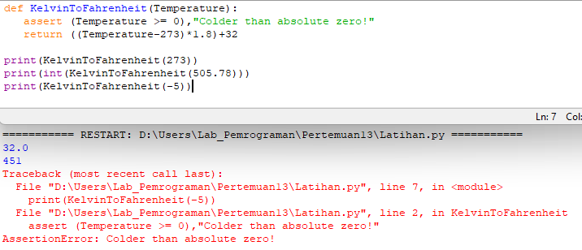

# Praktikum11

## Tugas pertemuan ke 13 Bahasa Pemrograman
## Nama : Ramadhan Ardi Iman Prakoso
## NIM : 312210722
## Kelas : TI.22.C.9
## Prodi : Teknik Informatika

# Tugas Praktikum 11

Pada pertemuan kali ini, tidak seperti kemarin yang mengerjakan praktikum. Pada repository ini, sekarang saya akan menuangkan hasil latihan Saya. Pada repository ini, saya akan menerangkan tentang exceptions handling / penanganan eksepsi. Langsung saja, tanpa basa basi lagi, ini lah hasil dari latihan saya.

## Pengertian

Pada python, ada dua fitur yang sangat penting untuk menangani kesalahan tidak terduga di dalam program dan juga menambah kemampuan debugging di dalamnya.

## Exception Handling

Exception Handling adalah suatu mekanisme pada python yang bertujuan untuk menangani sebuah error pada program. Error ini nantinya akan menghentikan program yang dijalankan dengan cara yang tidak normal.

## Assertion

Assertion adalah pemeriksaan kewajaran yang dapat di aktifkan atau nonaktifkan setelah kita menyelesaikan uji pada program.

## Assertion Statement

Saat menemukan pernyataan, Python mengevaluasi ekspresi yang menyertainya, yang mana diharapkan semoga benar. Jika ekspresi salah, Python memunculkan pengecualian AssertionError.
Syntax untuk assert itu adalah :
assert Expression[, Arguments]
Jika pernyataan gagal, Python menggunakan ArgumentExpression sebagai argumen untuk AssertionError. AssertionError exceptions dapat ditangkap dan ditangani seperti pengecualian lainnya menggunakan try-except statement, tetapi jika dibiarkan, mereka akan menghentikan program dan menghasilkan backtrace.
Contohnya
Berikut adalah fungsi yang mengubah suhu dari derajat Kelvin menjadi derajat Fahrenheit. Karena nol derajat Kelvin sedingin itu, fungsinya akan keluar jika melihat sebuah suhu negatif.

## Menangani sebuah pengecualian

Jika kita memiliki beberapa kode mencurigakan yang bisa memunculkan sebuah pengecualian, kita bisa mempertahankan programnya. Caranya adalah dengan menempatkan kode mencurigakan itu didalam sebuah try:block. Setelah try:block, masukkan sebuah except:statement, dibarengi dengan sebuah block kode yang menangani masalah itu dengan se-sempurna mungkin.

Syntax Ini adalah sebuah syntax sederhana dari try...except...else blocks

Contoh pertama
Dicontoh ini akan membuka file, lalu menulis ini file, dan akan keluar dengan normal karena tidak ada masalah didalamnya.

Contoh kedua
Dicontoh ini akan mencoba membuka sebuah file dimana kita tidak mempunyai izin untuk menulis, jadi nantinya akan memunculkan sebuah pengecualian.

## Pengecualian tanpa Exceptions
Kita bisa menggunakan except statement dengan no exceptions yang didefinisikan seperti ini :

Pernyataan try-except jenis ini menangkap semua pengecualian yang terjadi. Menggunakan jenis pernyataan try-exception ini tidak dianggap sebagai operasi yang baik, karena semua pengecualian ditangkap, tetapi tidak memungkinkan program untuk mengidentifikasi kemungkinan penyebab masalah.

## Pengecualian dengan beberapa Exceptions
kita bisa juga menggunakan except statement untuk mengatasi beberapa exceptions seperti ini :

## Try-finally
kita bisa menggunakan sebuah finally:block bersamaan dengan sebuah try:block. Finally Block adalah sebuah tempat untuk menempatkan kode yang harus di eksekusi, apakah try-block akan memunculkan pengecualian atau tidak.
Syntax dari try-finally statement adalah seperti ini :

Kita tidak bisa menggunakan else berbarengan dengan sebuah finally.
Contohnya

Contoh yang sama bisa ditulis lebih sempurna

Ketika pengecualian dilemparkan ke try-block, eksekusi segera diteruskan ke finally block. Setelah semua pernyataan di blok finally dieksekusi, pengecualian dimunculkan lagi dan ditangani di dalam pernyataan except jika ada di lapisan di atas pernyataan try-except berikutnya.

## Argumen dari sebuah pengecualian
Jika kita menulis sebuah kode untuk mengatasi sebuah pengecualian, kita bisa mendapatkan sebuah variabel mengikuti nama dari pengecualian tersebut. Jika kita terjebak di beberapa pengecualian, kita bisa mendapatkan sebuah variabel mengikuti tuple dari pengecualiannya.
Variabel ini menerima value dari pengecualian yang sebagian besar berisi penyebab dari pengecualian. Variabelnya bisa menerima sebuah value atau beberapa value dalam bentuk sebuah tuple. Tuple ini biasanya berisi string yang error, nomor yang error, dan lokasi errornya.
Contohnya

## Memunculkan sebuah Pengecualian
Kita bisa memunculkan sebuah pengecualian dengan berbagai cara menggunakan raise statement. Syntax untuk raise statement adalah sebagai berikut.
raise [Exception [, args [, traceback]]]
Contohnya
Sebuah pengecualian bisa berupa sebuah string, sebuah class atau sebuah objek. Umumnya pengecualian yang muncul pada python adalah sebuah class, dengan sebuah argumen yang mana itu adalah turunan dari class. Mendefinisikan pengecualian yang baru sangatlah mudah dan bisa diselesaikan dengan cara seperti ini:

Catatan: Untuk menangkap sebuah pengecualian, sebuah "except" harus merujuk ke pengecualian yang sama, baik itu class object atau simple string. Untuk contoh menangkap pengecualian diatas, kita harus menulis "except" seperti ini:

## Pengecualian buatan User
Python juga membebaskan kita untuk membuat pengecualian sendiri, dengan menurunkan kelas-kelas dari standar built-in pengecualian.
Berikut adalah sebuah contoh yang berkaitan ke RuntimeError. Disini, class yang dibuat merupakan subclass dari RuntimeError. Ini berguna ketika kita butuh untuk menampilkan informasi yang lebih spesifik, ketika sebuah pengecualian tertangkap.
Dalam try block, Pengecualian yang dibuat User memunculkan dan menangkap didalam except block. Variabelnya digunakan untuk membuat sebuah turunan dari class NetworkError.

Jadi ketika kita mendefinisikan class diatas, kita bisa memunculkan pengecualian dengan cara seperti ini :

## Penutup
Akhirnya, sudah sampailah kita dipenghujung repository ini. Itulah hasil dari latihan Exception yang telah saya kerjakan. Seperti biasa, jika ada kesalahan kata dalam pengetikan, Saya memohon maaf yang sebesar besarnya. Sekian dari repository ini saya buat. Saya ucapkan, Terimakasih...